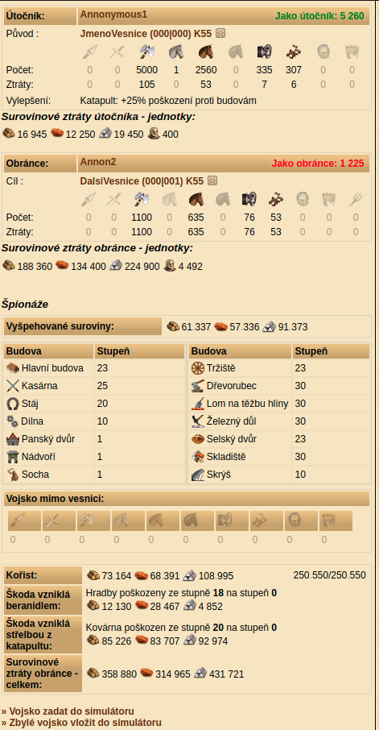
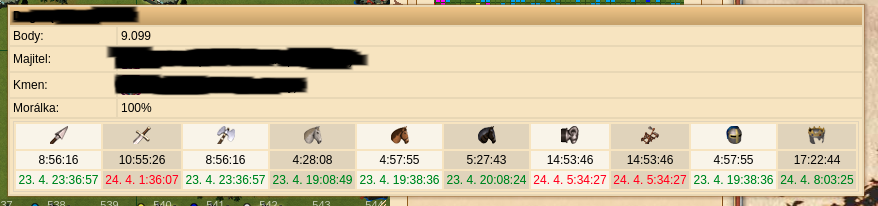

# CZ tribal wars scripts

Those scripts require ViolentMonkey extension to be present in the browser - because they are executed quite frequently and
manual invocation of those scripts make them practically unusable.

#### How to use scripts?
1. Install ViolentMonkey browser extension
2. When adding script 1st time - Open extension and select add new script then copy script content & Save.
3. Updating script - find script with matching name and replace content & Save.
4. Go to game page and profit (reload page to apply scripts).

## Scripts
* [Battle Report Enhancer](#Battle-Report-enhancer) - content of the script [./build/battleReportEnhancer.js](./build/battleReportEnhancer.js)
* [Map Unit Landing Times](#Map-Unit-Landing-Times) - content of the script [./build/mapUnitArrival.js](./build/mapUnitArrival.js)

## Battle Report enhancer
This script require localization for correct behavior (parsing damage done to buildings). Supported ones are now: CZ.
To add localization for game language raise issue and help provide required texts.
### Purpose
Basically parse report and add statistic data. For example:
 * Kill scores as attacker and as defender if units in reports are visible. Table for those computations is taken from [forum](https://forum.tribalwars.net/index.php?threads/how-are-opponents-defeated-scores-calculated.110880)
 * Lost units (if visible in report) recruitment resource cost and population.
 * Damage to buildings - ram, catapults. Again added resource costs of damaged buildings.
 * Overall resource lost as defender -> lost units + damage to buildings + stolen resources.

### What resource script uses?
Loads game world configuration for units to determine which units are present in game world. From `<worldUrl>/interface.php?func=get_unit_info`
Loads game world configuration for buildings so cost of damaged buildings can be calculated. From `<worldUrl>/interface.php?func=get_building_info`
Use browser local storage to cache those configs - those data are static no need to fetch them frequently.

### Usage
Download ViolentMonkey extension to your browser and then add content of file [./build/reportEnhancer.js](./build/battleReportEnhancer.js) as new script.

## Map Unit Landing Times
### Purpose
Enhance map screen.
Add landing times for each unit type calculated from currently selected village and current date time. Those data are 
displayed when pointing to some village. Green color indicate arrival during 'day' period. Red text arrival during night bonus period.

### What resource script uses?
Loads game world configuration so night bonus period can be calculated. From `<worldUrl>/interface.php?func=get_config`.
Store cached config in browser local storage.

## Usage
Download ViolentMonkey extension to your browser and then add content of file [./build/mapUnitArrival.js](./build/mapUnitArrival.js) as new script.